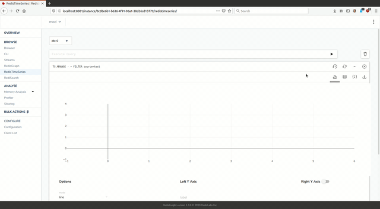

# ProphetGears




## Run
```bash
docker build --tag redislabs/prophetgears:edge .
docker run -p 6379:6379 -it --rm redislabs/prophetgears:edge
```

```bash
python3 load.py 
python3 gears.py --requirements ./requirements.txt predict.py
```

```
./redisinsight-linux64-1.3.1
```

